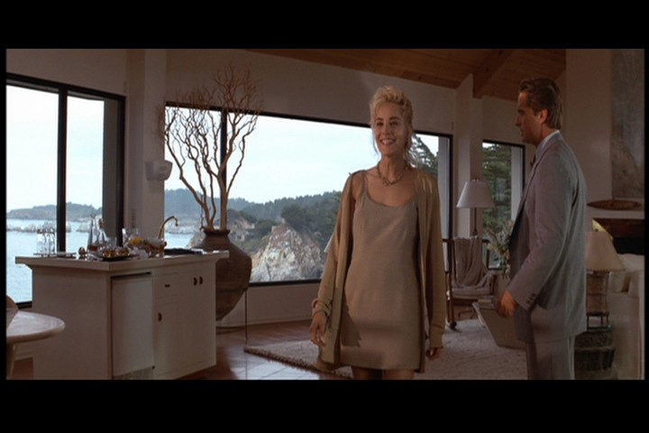
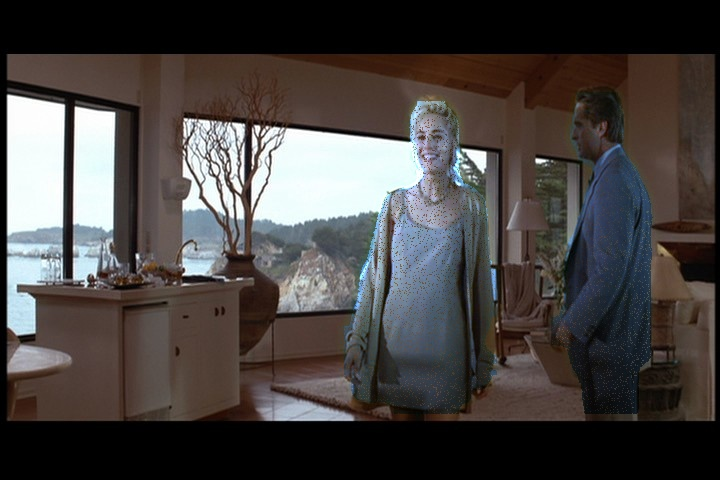
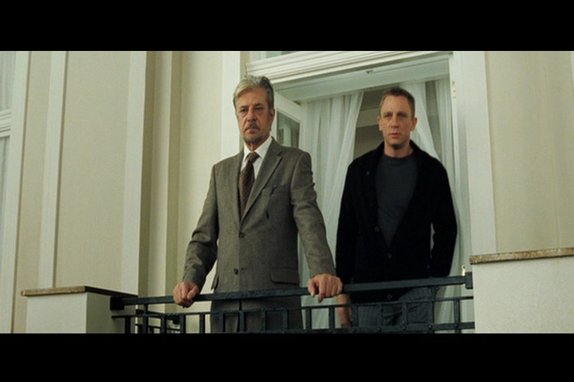
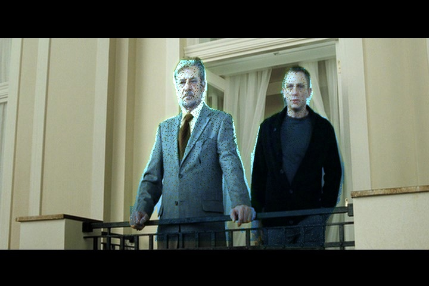
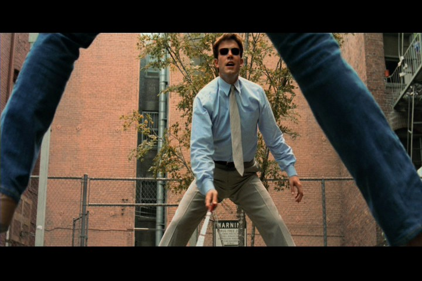
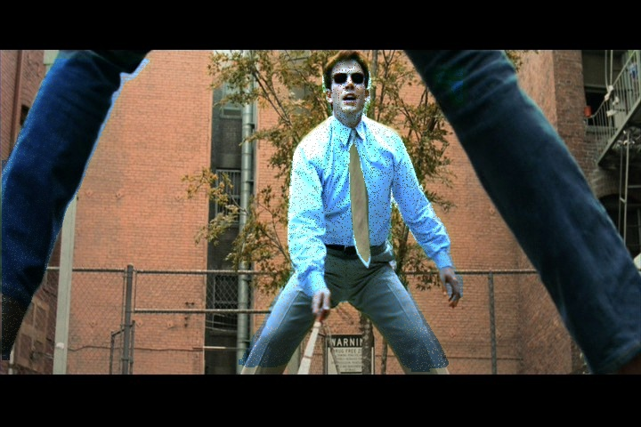
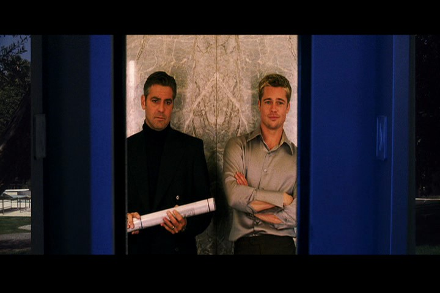
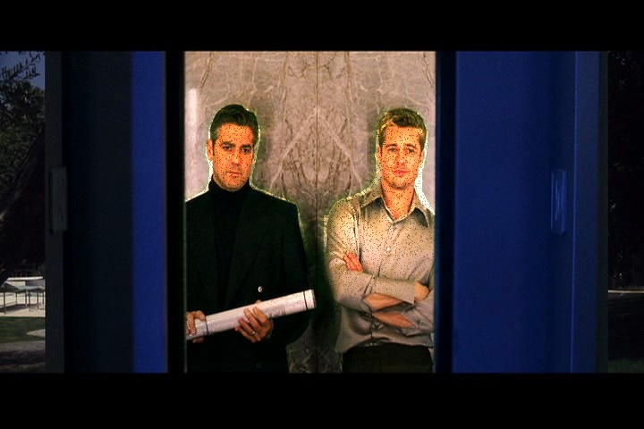
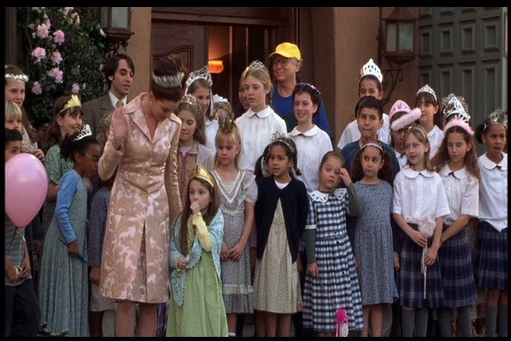
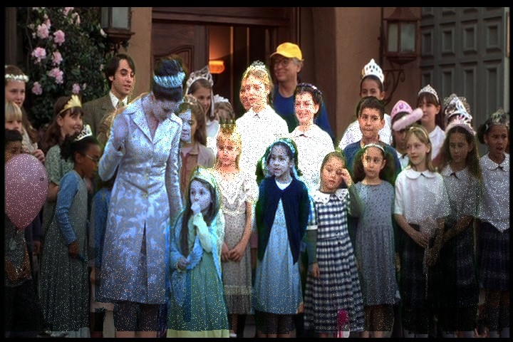

# 🎬 Composite Domain Transfer

**Turn professional Hollywood movie shots into bad green screen composites.**  
This project simulates visual artifacts commonly associated with amateur or flawed compositing, including hard matte edges, color spill, lighting mismatch, and temperature errors.

---

## 🧠 Motivation

While most research in visual effects and deep learning aims to *improve* visual realism, this project does the opposite:

> It intentionally degrades clean movie frames to simulate poor green screen compositing — useful for:
- Data augmentation for training compositing/relighting networks
- Reverse-domain transfer for realism enhancement
- Testing robustness of segmentation or matting models

---

## 💡 Features

- ✅ Actor/person segmentation via YOLOv8 segmentation model
- ✅ Hard matte edge simulation
- ✅ Lighting inconsistency via fake gradients and spotlights
- ✅ Subtle color spill (green halo/fringe)
- ✅ Temperature mismatch based on scene statistics
- ✅ Matte chatter / edge noise (flicker artifacts)
- ✅ Batch processing from folders
- ✅ Progress tracking via `tqdm`

---

## 🖼️ Before & After 

| Movie | Good Composite | Bad Composite |
|-------|----------------|----------------|
| *Basic Instinct* |  |  |
| *Casino Royale* |  |  |
| *Daredevil* |  |  |
| *Oceans Eleven* |  |  |
| *Princess Diaries 2* |  |  |


---

## 🛠️ Installation

```bash
git clone https://github.com/YOUR_USERNAME/composite-domain-transfer.git
cd composite-domain-transfer
pip install -r requirements.txt
